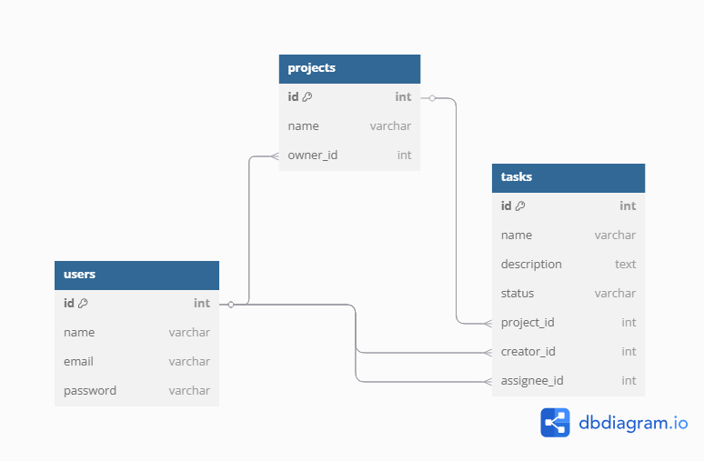

# Gerenciador de Tarefas - Teste Senior Hcosta

Este projeto é uma API RESTful desenvolvida em **Laravel 12**, com arquitetura **modular baseada em DDD (Domain-Driven Design)**. Ele implementa autenticação via **JWT**, persistência via **Eloquent**, logs em **MongoDB**, filas com **RabbitMQ**, e um alto nível de separação de responsabilidades para facilitar manutenção e escalabilidade.

---

## ⚡ Iniciar Aplicação

```Rodar no terminal
./docker/build-docker.sh
```

Após isso, a API estará acessível em:
```
http://localhost:8080/api
```

---

## 🌐 Funcionalidades

- Registro, login e logout com JWT
- CRUD de projetos (somente dono pode editar/deletar)
- CRUD de tarefas (somente responsável pode editar)
- Notificação via RabbitMQ ao criar ou atribuir tarefa
- Log de eventos importantes em MongoDB

Link para documentação das APIs: https://documenter.getpostman.com/view/20929682/2sB2qWJ59T

---

## 🗂️ Diagrama do Banco de Dados



---

## 📂 Explicando Arquitetura

```
app/
└── Modules/
    ├── Auth/
    │   ├── Domain/         → Entidade e contrato de User
    │   ├── Application/    → AuthService (login, register, logout)
    │   ├── Infrastructure/ → Model Eloquent e UserRepository
    │   └── Interfaces/     → AuthController, FormRequests e rotas
    
    ├── Project/
    │   ├── Domain/         → Entidade Project e interface ProjectRepository
    │   ├── Application/    → ProjectService
    │   ├── Infrastructure/ → Model Eloquent e repositorio
    │   └── Interfaces/     → Controller, Request, Routes

    └── Task/
        └── Mesma estrutura, com Entities, Jobs, Services e Repositories
```

---

## 🧠 Motivação das Decisões Técnicas

### 📊 Modularização com DDD
- Cada módulo representa um **contexto de negócio isolado** (Auth, Project, Task)
- Permite evoluir funcionalidades sem gerar acoplamento entre camadas
- Facilita escalar o sistema e eventualmente quebrar em micro-serviços

### 📖 Separation of Concerns (SoC)
- **Entities**: representam o "cérebro do sistema", com regras puras
- **Repositories**: definem *como* buscar ou salvar (interfaces)
- **Application Services**: executam ações como criar projeto ou login
- **Infrastructure**: Eloquent, RabbitMQ, MongoDB, etc.
- **Interfaces/Http**: único ponto que fala com o mundo externo (API)

### ✅ Por que usar interfaces?
- Separar o **domínio** da tecnologia (Eloquent pode mudar por Mongo, Redis, etc.)
- Permite uso de **mocks em testes** facilmente

---

## ⚙ Tecnologias utilizadas
- Laravel 12
- tymon/jwt-auth (JWT)
- jenssegers/mongodb (Mongo)
- vladimir-yuldashev/laravel-queue-rabbitmq
- Docker

---

## ✅ Testes e Qualidade
- Testes com PHPUnit
- Fácil de mockar services e repositórios
- Ideal para TDD com arquitetura limpa

---

Desenvolvido com foco em arquitetura, manutenção e escalabilidade ✨
